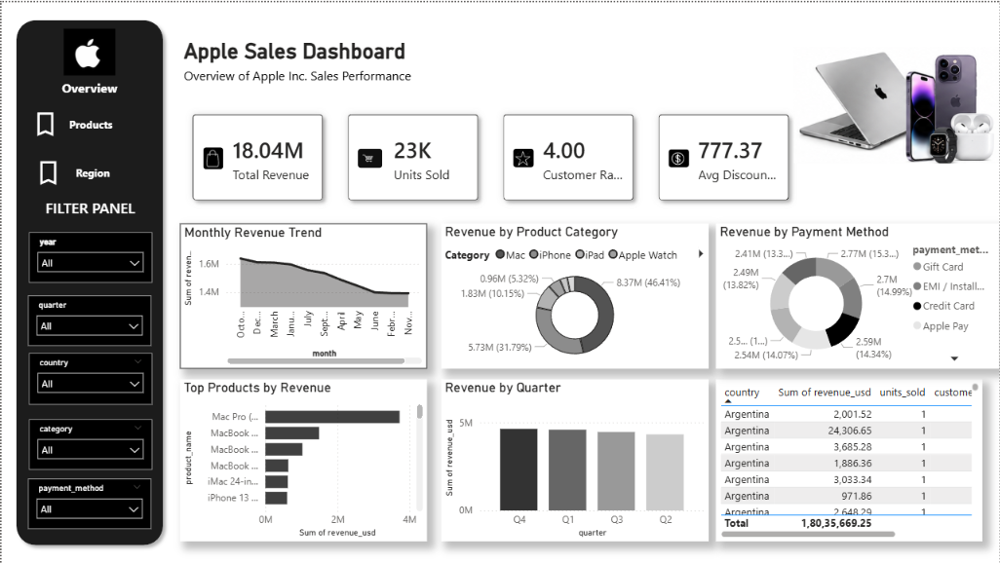

# 🍎 Apple Sales Dashboard

An interactive **Apple Sales Dashboard** built using **Power BI** to analyze sales performance across products, regions, quarters, and payment methods.

## 📊 Dashboard Preview

## 🔍 Key Insights

* Total Revenue: **18.04M**
* Units Sold: **23K**
* Customer Rating: **4.00**
* Average Discount: **777.37**
* Monthly revenue trends
* Revenue by product category
* Revenue by payment method
* Top products by revenue
* Revenue by quarter
* Country-level sales analysis

## 🛠️ Tools & Technologies

* Power BI
* Data Visualization
* Data Analysis
* DAX
* Microsoft Excel / CSV

## 📌 Dashboard Features

* Interactive year filter
* Quarter filter
* Country filter
* Product category filter
* Payment method filter
* Revenue trend analysis
* Product performance analysis
* Regional sales analysis

## 📁 Project Files

* `dashboard/` – Power BI dashboard file
* `images/` – Dashboard screenshots
* `data/` – Dataset used for analysis

## 🎯 Objective

The objective of this project is to analyze Apple sales data and create an interactive dashboard that helps users understand revenue trends, product performance, customer behavior, and regional sales.

## 👤 Author

**Your Name**

B.Sc Data Science
